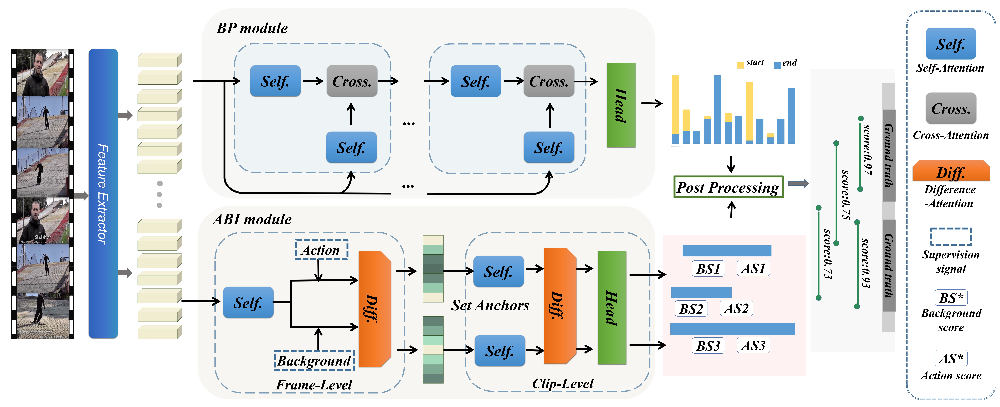

# Temporal Action Proposal Generation with Background Constraint (AAAI 2022)


This repository contains the source code of the [BCNet](https://arxiv.org/abs/2112.07984) (Background Constraint Network).
## TODOs
- [x] add Inference code
- [x] add Training code

## Overview

Temporal action proposal generation (TAPG) is a challenging task that aims to locate action instances in untrimmed videos with temporal boundaries.
To evaluate the confidence of proposals, the existing works typically predict action score of proposals that are supervised by the temporal Intersection-over-Union (tIoU) between proposal and the ground-truth.
In this paper, we innovatively propose a general auxiliary Background Constraint idea to further suppress low-quality proposals, by utilizing the background prediction score to restrict the confidence of proposals. In this way, the Background Constraint concept can be easily plug-and-played into existing TAPG methods (e.g., BMN, GTAD). 
From this perspective, we propose the Background Constraint Network (BCNet) to further take advantage of the rich information of action and background. Specifically, we introduce an Action-Background Interaction module for reliable confidence evaluation, which models the inconsistency between action and background by attention mechanisms at the frame and clip levels.
Extensive experiments are conducted on two popular benchmarks,i.e., ActivityNet-1.3 and THUMOS14. The results demonstrate that our method outperforms state-of-the-art methods. Equipped with the existing action classifier, our method also achieves remarkable performance on the temporal action localization task.


## Installation
* Create conda environment
    ```bash
	conda create -n bcnet python=3.7 -y
	source activate bcnet
    ```

* Requirements
    ```bash
	git clone https://github.com/happy-lifi/BCNet.git
	cd BCNet
	pip install -r requirements.txt
    ```
## Data setup
We use the features provided by [G-TAD](https://github.com/Frostinassiky/gtad). 
To reproduce the results in THUMOS14 without further changes:

* Download the data from [GooogleDrive](https://drive.google.com/drive/folders/10PGPMJ9JaTZ18uakPgl58nu7yuKo8M_k?usp=sharing) or
[OneDrive](https://kaust-my.sharepoint.com/:f:/g/personal/xum_kaust_edu_sa/EgTwwUGf0O1Kug_A6ym-y_8BlEJ04_xPME9EFbAAKRPQNw?e=AVgHlW).

* Place it into a folder named `TSN_pretrain_avepool_allfrms_hdf5` inside `data/thumos_feature`.


> You could also pass the folder containing the HDF5 files if the script admits the following argument `--feature_path`.
## Training	
	sh ./run/bcn_train.sh
## Testing
	sh ./run/bcn_infer.sh
## THUMOS Results

|Method|Feature|mAP@0.3|mAP@0.4|mAP@0.5|mAP@0.6|mAP@0.7|checkpoint|
| :----: |:----: | :--: | :----: | :---: | :----: |:----: |:----: |
|BCNet|TSN |67.4| 61.0 |52.5| 42.4| 29.9|[[GooogleDrive](https://drive.google.com/file/d/1rK8rWfjdOUMzhOpz1QIv1J-Kcf2QO7hK/view?usp=sharing)]

## Acknowledgement

We especially thank the contributors of  [BMN](https://github.com/JJBOY/BMN-Boundary-Matching-Network) and [G-TAD](https://github.com/Frostinassiky/gtad) for providing helpful code.

## Citing
```
@article{yang2021temporal,
  title={Temporal Action Proposal Generation with Background Constraint},
  author={Yang, Haosen and Wu, Wenhao and Wang, Lining and Jin, Sheng and Xia, Boyang and Yao, Hongxun and Huang, Hujie},
  journal={Proceedings of the AAAI Conference on Artificial Intelligence},
  year={2021}
}
```
## Contact
For any question, please file an issue or contact
```
Haosen Yang: haosen.yang.6@gmail.com
Wenhao Wu: whwu.ucas@gmail.com
```


